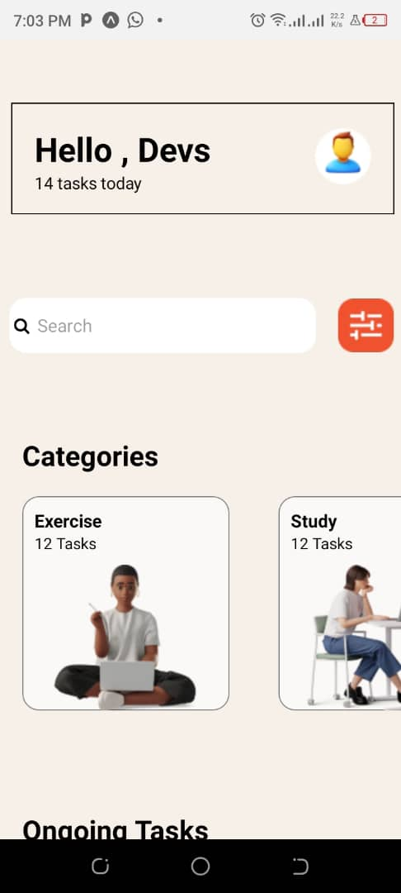
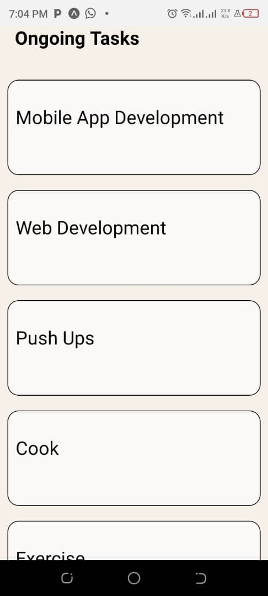
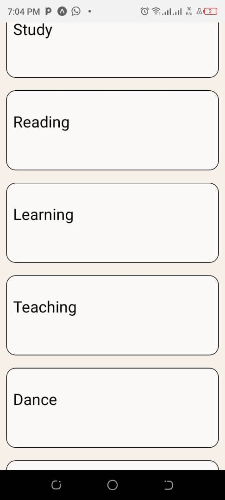
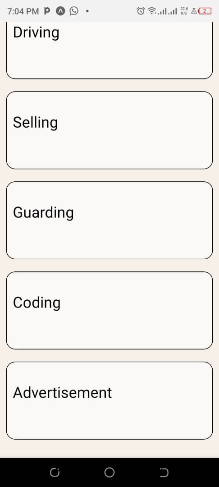

# rn-assignment3-11330842

## Description
This project is a task management application built with React Native and Expo. It includes categories such as Exercise, Study, Code, Cook, etc., and provides a list of ongoing tasks.

## Components
- **Welcome**: Displays the title of the app.
- **Category**: Scrollable list of task categories.
- **Ongoing Task**: List of ongoing tasks using FlatList.

## Screenshots

## Student ID
11330842
